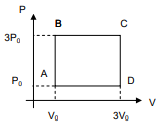

# Parcial 1 - Fisica 3 - 2025

1. Una lente de vidrio, con un índice de refracción $n_{vidrio}$ de 1.5, está recubierta con una película delgada antirreflectante de 140 nm de espesor. Esta película tiene un índice de refracción $n_{pelicula}$ superior al del aire $n_{aire}$ pero inferior al del vidrio. El propósito de este recubrimiento es minimizar la reflexión de la luz roja con una longitud de onda de 760 nm en el vacío.

- Se pide:

    - Calcule el índice de refracción de la película antirreflectante.
    - Si la lente se ilumina con luz blanca, ¿qué colores del espectro visible se reflejarán con mayor intensidad?
    - Partiendo de la condición de interferencia destructiva para la luz reflejada, deduzca la fórmula para la interferencia constructiva.

2. Se tiene un ciclo termodinamico como el de la imagen con los siguientes valores iniciales: $P_i = 100000 Pa$; $V_i = 1 m^3$; $T_i = 300 K$.

  

Encontrar el trabajo total que se da en el ciclo y el calor total dado por el ciclo  

3. Una máquina térmica opera entre dos focos térmicos: uno caliente a una temperatura de $T_c = 300 °C$ y uno frío a una temperatura de $T_f = 100 °C$. Durante cada ciclo, la máquina absorbe 100 kJ de calor del foco caliente y realiza un trabajo neto de 50 kJ.

- Se pide:

    - Eficiencia de la máquina térmica.
    - El rendimiento máximo teórico posible para una máquina que opera entre estas dos temperaturas
    - La cantidad de calor cedido al foco frio