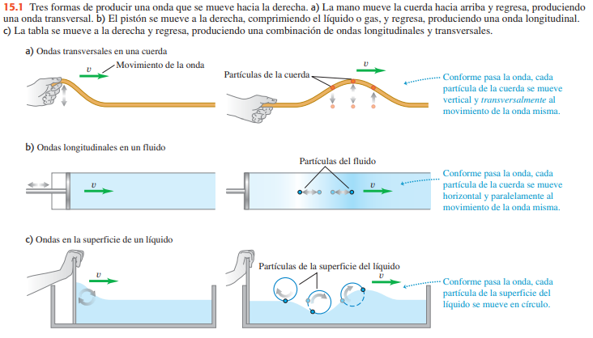
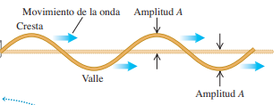
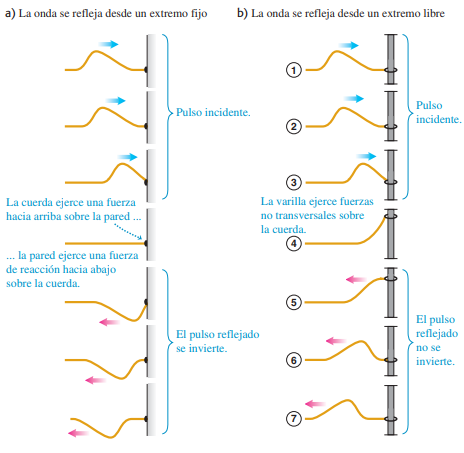
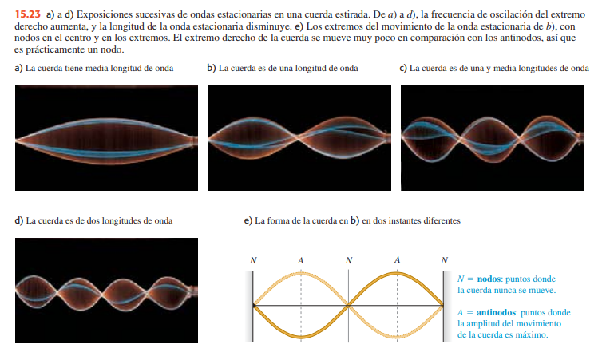

# Fisica 3 - Resumen sin IA

## Ondas

### Ondas mecanicas:

Una **onda mecánica** es una perturbación que viaja por un material o una sustancia
que es el medio de la onda. Al viajar la onda por el medio, las partículas que constituyen el medio sufren desplazamientos de varios tipos, dependiendo de la naturaleza de
la onda.

#### **Variedades de ondas mecanicas:**

- **Onda transversal:** Los desplazamientos del medio son perpendiculares o transversales a
la dirección en que la onda viaja por el medio.

- **Onda longitudinal:** Los movimientos de las partículas del medio son hacia adelante y hacia atrás en la misma línea en que viaja la onda.

La imagen *15.1.c* muestra desplazamientos de agua que tienen componentes tanto longitudinal como transversal.

Cada uno de estos sistemas tiene un estado de equilibrio.

En el primer caso **(a)**, es el estado en que el sistema está en reposo, estirada en línea recta. Para el segundo caso **(b)**, es un estado en que el fluido está en reposo con presión uniforme y en el caso **(c)**, una superficie lisa y plana.

En cada caso, el movimiento ondulatorio es una perturbación del estado de equilibrio que viaja de una región del medio a otra, y siempre hay fuerzas que tienden a volver el sistema a su posición de equilibrio cuando se lo desplaza.

Estos ejemplos tienen tres cosas en común. Primeramente, la perturbación siempre viaja o se propaga por el medio con una rapidez definida llamada rapidez de propagación o, simplemente, **rapidez de la onda**. El medio mismo no viaja por el espacio; sus partículas individuales realizan movimientos verticales y horizontales alrededor de sus posiciones de equilibrio.

Para poner en movimiento cualesquiera de estos sistemas, debemos aportar energía realizando trabajo mecánico sobre el sistema. La onda transporta esta energía de una región del medio a otra. *Las ondas transportan energía, pero no materia, de una región a otra.*

### Ondas periodicas:

Una onda periódica se da cuando imprimimos un movimiento repetitivo, o periódico al extremo libre de la cuerda, entonces cada partícula de la cuerda tendrá un movimiento periódico al propagarse la onda.

Si movemos verticalmente la cuerda con amplitud *A*, frecuencia *f*, frecuencia angular $\omega = 2 \cdot \pi \cdot f$ y periodo $T = \frac{1}{f} = \frac{2 \cdot \pi}{\omega}$, veremos que la onda producida es una sucesión simétrica de crestas y valles facil de analizar
que las llamaremos ondas senoidales.

La onda que avanza por la cuerda es una sucesión continua de perturbaciones senoidales transversales. Cuando una onda senoidal pasa por un medio, todas las partículas del medio sufren movimiento armónico simple con la misma frecuencia.

En el caso de una onda periódica, la forma de la cuerda en cualquier instante es un patrón repetitivo. La longitud de un patrón de onda completo es la distancia entre una cresta y la siguiente, o de un valle al siguiente, o de cualquier punto al punto correspondiente en la siguiente repetición de la forma. Llamamos a esta distancia **longitud de onda.** El mismo presenta la siguiente ecuacion: $v = \lambda \cdot f$

### Descripcion matematica de la onda:

Para esta descripción, necesitamos el concepto de función de onda, una función que describe la posición de cualquier partícula en el medio en cualquier instante.

Durante el movimiento ondulatorio una partícula con posición de equilibrio $x$ se desplaza cierta distancia $y$ en la dirección perpendicular al eje $x$. El valor de $y$ depende de cuál partícula estamos considerando y también del instante $t$ en que la consideramos. Así, $y$ es función tanto de $x$ como de $t$. Llamamos a $y(x, t)$ la **función de onda** que describe la onda.

Los movimientos cíclicos de diversos puntos de la cuerda están desfasados entre sí en diversas fracciones de un ciclo. Llamamos a éstas **diferencias de fase**, y decimos que la fase del movimiento es diferente para diferentes puntos.

El desplazamiento de una partícula en el extremo izquierdo de la cuerda $(x = 0)$, donde la onda se origina, está dado por:

$$y(x=0, t) = A \cdot cos(v \cdot t) = A \cdot cos(2 \cdot \pi \cdot f \cdot t)$$

La notación $y(x = 0, t)$ nos recuerda que el movimiento de esta partícula es un caso especial de la función de onda $y(x, t)$ que describe toda la onda

En $t = 0$, la partícula en $x = 0$ tiene máximo desplazamiento positivo $(y = A)$ y está instantáneamente en reposo.

La perturbación ondulatoria viaja de $x = 0$ a algún punto $x$ a la derecha del origen en un tiempo dado por $x/v$, donde $v$ es la rapidez de la onda. Así, el movimiento del punto $x$ en el instante $t$ es el mismo que el movimiento del punto $x = 0$ en el instante anterior $t - x/v$. Por lo tanto, podemos obtener el desplazamiento del punto $x$ en el instante $t$ con sólo sustituir $t$ en la ecuación por $(t - x/v)$. Esto nos queda:

$$y(x, t) = A \cdot cos[\omega \cdot (t - \frac{x}{v})]$$

Otra forma útil de la función de onda, si definimos una cantidad $k$ llamada
**número de onda:** $k = \frac{2 \cdot \pi}{\lambda}$

Sustituyendo $\lambda = \frac{2\cdot\pi}{k}$ y $f=\frac{\omega}{2\cdot\pi}$ en la relación longitud de onda-frecuencia $v = \lambda\cdot f$ obtenemos

$$y(x, t) = A \cdot cos (kx - \omega t)$$

### Interferencia de ondas

Cuando una onda choca contra las fronteras de su medio, se refleja parcial o totalmente. La onda inicial y la reflejada se traslapan en la misma región del medio. Este traslape de ondas se denomina interferencia.

### Principio de superposicion:

Combinar los desplazamientos de los pulsos individuales en cada punto para obtener el desplazamiento real es un ejemplo del principio de superposición: cuando dos ondas se traslapan, el desplazamiento real de cualquier punto de la cuerda en cualquier instante se obtiene sumando el desplazamiento que tendría el punto si sólo estuviera presente la primera onda, con el desplazamiento que tendría si sólo estuviera presente la segunda.

$$y(x, t) = y_1(x, t) + y_2(x, t)$$

### Ondas estacionarias:

En una onda que viaja por la cuerda, la amplitud es constante y el patrón de la onda se mueve con rapidez igual a la rapidez de la onda. Aquí, en cambio, el patrón de la onda permanece en la misma posición en la cuerda, y su amplitud fluctúa. Hay ciertos puntos llamados nodos que nunca se mueven. A la mitad del camino entre los nodos hay puntos llamados antinodos donde la amplitud de movimiento es máxima. Dado que el patrón no parece estarse moviendo a lo largo de la cuerda, se denomina onda estacionaria.

En un nodo, los desplazamientos de las dos ondas siempre son iguales y opuestos, y se cancelan. Esta cancelación se llaman **interferencia destructiva**. A la mitad del camino entre los nodos están los puntos de máxima amplitud o antinodos. En los antinodos, los desplazamientos de las dos ondas siempre son idénticos, dando un desplazamiento resultante grande; este fenómeno se llama **interferencia constructiva**.