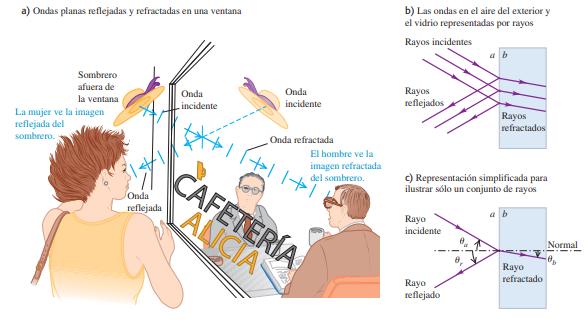
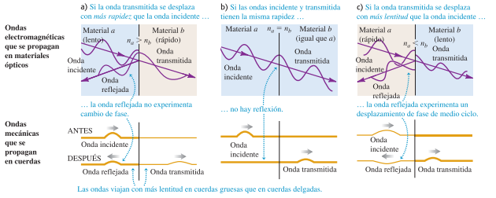
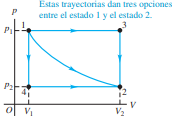

# Fisica 3 - Resumen sin IA

## Ondas

### Ondas mecanicas:

Una **onda mecánica** es una perturbación que viaja por un material o una sustancia
que es el medio de la onda. Al viajar la onda por el medio, las partículas que constituyen el medio sufren desplazamientos de varios tipos, dependiendo de la naturaleza de
la onda.

#### **Variedades de ondas mecanicas:**

- **Onda transversal:** Los desplazamientos del medio son perpendiculares o transversales a
la dirección en que la onda viaja por el medio.

- **Onda longitudinal:** Los movimientos de las partículas del medio son hacia adelante y hacia atrás en la misma línea en que viaja la onda.

La imagen *15.1.c* muestra desplazamientos de agua que tienen componentes tanto longitudinal como transversal.

Cada uno de estos sistemas tiene un estado de equilibrio.

En el primer caso **(a)**, es el estado en que el sistema está en reposo, estirada en línea recta. Para el segundo caso **(b)**, es un estado en que el fluido está en reposo con presión uniforme y en el caso **(c)**, una superficie lisa y plana.

En cada caso, el movimiento ondulatorio es una perturbación del estado de equilibrio que viaja de una región del medio a otra, y siempre hay fuerzas que tienden a volver el sistema a su posición de equilibrio cuando se lo desplaza.

Estos ejemplos tienen tres cosas en común. Primeramente, la perturbación siempre viaja o se propaga por el medio con una rapidez definida llamada rapidez de propagación o, simplemente, **rapidez de la onda**. El medio mismo no viaja por el espacio; sus partículas individuales realizan movimientos verticales y horizontales alrededor de sus posiciones de equilibrio.

Para poner en movimiento cualesquiera de estos sistemas, debemos aportar energía realizando trabajo mecánico sobre el sistema. La onda transporta esta energía de una región del medio a otra. *Las ondas transportan energía, pero no materia, de una región a otra.*

### Ondas periodicas:

Una onda periódica se da cuando imprimimos un movimiento repetitivo, o periódico al extremo libre de la cuerda, entonces cada partícula de la cuerda tendrá un movimiento periódico al propagarse la onda.

Si movemos verticalmente la cuerda con amplitud *A*, frecuencia *f*, frecuencia angular $\omega = 2 \cdot \pi \cdot f$ y periodo $T = \frac{1}{f} = \frac{2 \cdot \pi}{\omega}$, veremos que la onda producida es una sucesión simétrica de crestas y valles facil de analizar
que las llamaremos ondas senoidales.

La onda que avanza por la cuerda es una sucesión continua de perturbaciones senoidales transversales. Cuando una onda senoidal pasa por un medio, todas las partículas del medio sufren movimiento armónico simple con la misma frecuencia.

En el caso de una onda periódica, la forma de la cuerda en cualquier instante es un patrón repetitivo. La longitud de un patrón de onda completo es la distancia entre una cresta y la siguiente, o de un valle al siguiente, o de cualquier punto al punto correspondiente en la siguiente repetición de la forma. Llamamos a esta distancia **longitud de onda.** El mismo presenta la siguiente ecuacion: $v = \lambda \cdot f$

### Descripcion matematica de la onda:

Para esta descripción, necesitamos el concepto de función de onda, una función que describe la posición de cualquier partícula en el medio en cualquier instante.

Durante el movimiento ondulatorio una partícula con posición de equilibrio $x$ se desplaza cierta distancia $y$ en la dirección perpendicular al eje $x$. El valor de $y$ depende de cuál partícula estamos considerando y también del instante $t$ en que la consideramos. Así, $y$ es función tanto de $x$ como de $t$. Llamamos a $y(x, t)$ la **función de onda** que describe la onda.

Los movimientos cíclicos de diversos puntos de la cuerda están desfasados entre sí en diversas fracciones de un ciclo. Llamamos a éstas **diferencias de fase**, y decimos que la fase del movimiento es diferente para diferentes puntos.

El desplazamiento de una partícula en el extremo izquierdo de la cuerda $(x = 0)$, donde la onda se origina, está dado por:

$$y(x=0, t) = A \cdot cos(v \cdot t) = A \cdot cos(2 \cdot \pi \cdot f \cdot t)$$

La notación $y(x = 0, t)$ nos recuerda que el movimiento de esta partícula es un caso especial de la función de onda $y(x, t)$ que describe toda la onda

En $t = 0$, la partícula en $x = 0$ tiene máximo desplazamiento positivo $(y = A)$ y está instantáneamente en reposo.

La perturbación ondulatoria viaja de $x = 0$ a algún punto $x$ a la derecha del origen en un tiempo dado por $x/v$, donde $v$ es la rapidez de la onda. Así, el movimiento del punto $x$ en el instante $t$ es el mismo que el movimiento del punto $x = 0$ en el instante anterior $t - x/v$. Por lo tanto, podemos obtener el desplazamiento del punto $x$ en el instante $t$ con sólo sustituir $t$ en la ecuación por $(t - x/v)$. Esto nos queda:

$$y(x, t) = A \cdot cos[\omega \cdot (t - \frac{x}{v})]$$

Otra forma útil de la función de onda, si definimos una cantidad $k$ llamada
**número de onda:** $k = \frac{2 \cdot \pi}{\lambda}$

Sustituyendo $\lambda = \frac{2\cdot\pi}{k}$ y $f=\frac{\omega}{2\cdot\pi}$ en la relación longitud de onda-frecuencia $v = \lambda\cdot f$ obtenemos

$$y(x, t) = A \cdot cos (kx - \omega t)$$

### Interferencia de ondas

Cuando una onda choca contra las fronteras de su medio, se refleja parcial o totalmente. La onda inicial y la reflejada se traslapan en la misma región del medio. Este traslape de ondas se denomina interferencia.

### Principio de superposicion:

Combinar los desplazamientos de los pulsos individuales en cada punto para obtener el desplazamiento real es un ejemplo del principio de superposición: cuando dos ondas se traslapan, el desplazamiento real de cualquier punto de la cuerda en cualquier instante se obtiene sumando el desplazamiento que tendría el punto si sólo estuviera presente la primera onda, con el desplazamiento que tendría si sólo estuviera presente la segunda.

$$y(x, t) = y_1(x, t) + y_2(x, t)$$

### Ondas estacionarias:

En una onda que viaja por la cuerda, la amplitud es constante y el patrón de la onda se mueve con rapidez igual a la rapidez de la onda. Aquí, en cambio, el patrón de la onda permanece en la misma posición en la cuerda, y su amplitud fluctúa. Hay ciertos puntos llamados nodos que nunca se mueven. A la mitad del camino entre los nodos hay puntos llamados antinodos donde la amplitud de movimiento es máxima. Dado que el patrón no parece estarse moviendo a lo largo de la cuerda, se denomina onda estacionaria.

En un nodo, los desplazamientos de las dos ondas siempre son iguales y opuestos, y se cancelan. Esta cancelación se llaman **interferencia destructiva**. A la mitad del camino entre los nodos están los puntos de máxima amplitud o antinodos. En los antinodos, los desplazamientos de las dos ondas siempre son idénticos, dando un desplazamiento resultante grande; este fenómeno se llama **interferencia constructiva**.

### Descripción matemática de la Onda Estacionaria

Podemos deducir la función de onda para una onda estacionaria utilizando el principio de superposición. Consideremos una onda senoidal que viaja hacia la izquierda (onda incidente) y choca contra un extremo fijo en `x = 0`. Esta onda se refleja y viaja hacia la derecha (onda reflejada).

La reflexión en un **extremo fijo** invierte la onda, lo que equivale a un desfase de 180° o π radianes. Por lo tanto, si la onda reflejada es `y₂(x, t)`, la onda incidente debe tener un signo opuesto.

1.  **Onda incidente** (viaja a la izquierda, hacia el extremo fijo):
    $$y_1(x, t) = -A \cdot \cos(kx + \omega t)$$

2.  **Onda reflejada** (viaja a la derecha, alejándose del extremo fijo):
    $$y_2(x, t) = A \cdot \cos(kx - \omega t)$$

La onda estacionaria resultante es la suma de estas dos ondas viajeras:

$$y(x, t) = y_1(x, t) + y_2(x, t) = A[-\cos(kx + \omega t) + \cos(kx - \omega t)]$$

Para simplificar esta expresión, usamos la identidad trigonométrica para la suma y diferencia de cosenos. Tras aplicar la identidad y combinar términos, obtenemos la función de la onda estacionaria:

$$y(x, t) = (2A \cdot \operatorname{sen} kx) \cdot \operatorname{sen} \omega t$$

Podemos reescribir esta ecuación como:

$$y(x, t) = (A_{sw} \cdot \operatorname{sen} kx) \cdot \operatorname{sen} \omega t$$

Donde $A_{sw} = 2A$ es la amplitud máxima en los puntos de interferencia constructiva (los antinodos).

Esta ecuación final es muy reveladora y confirma lo que observamos en una onda estacionaria:

*   **Factor de Amplitud (dependiente de la posición):** El término $(A_{sw} \operatorname{sen} kx)$ actúa como una amplitud que **depende de la posición `x`**. No es constante como en una onda viajera.
    *   En los **nodos**, la amplitud es siempre cero. Esto ocurre cuando $\operatorname{sen} kx = 0$.
    *   En los **antinodos**, la amplitud es máxima ($A_{sw}$). Esto ocurre cuando $\operatorname{sen} kx = \pm1$.
*   **Factor de Oscilación (dependiente del tiempo):** El término $(\operatorname{sen} \omega t)$ muestra que todas las partículas de la cuerda realizan un movimiento armónico simple con la misma frecuencia angular $\omega$. A diferencia de una onda viajera, la forma de la onda no se propaga, sino que permanece en la misma posición, oscilando verticalmente.

---

## Sonido

### Ondas sonoras

La definición más general del sonido es una onda longitudinal en un medio. Las ondas sonoras más sencillas son las senoidales, las cuales tienen la frecuencia, la amplitud y la longitud de onda completamente especificadas. Las ondas sonoras suelen dispersarse en todas direcciones a partir de la fuente sonido, con una amplitud que depende de la dirección y la distancia a la fuente.

### Intensidad del sonido

Las ondas sonoras viajeras, al igual que todas las ondas viajeras, transfieren energía
de una región del espacio a otra. La energía transportada por un sonido con intensidad de la onda $I$, que es igual a la rapidez media con que la onda transporta energía, por unidad de área, a través de una superficie perpendicular a la dirección de propagación.

consideremos una onda sonora que se propaga en la dirección 1x, con la finalidad de poder usar las expresiones para el desplazamiento $y(x, t)$ y la fluctuación de la presión $p(x, t)$.

Por lo tanto, la potencia por unidad de área en esta onda sonora es igual al producto de $p(x, t)$ por la velocidad de la partícula, $v_y(x, t)$ es:

$$v_y(x, t) = \frac{\partial y(x, t)}{\partial t} = \omega A \cdot sen(kx-wt)$$

$$p(x, t)v_y(x, t) = [BkA \cdot sen(kx-wt)] [\omega A \cdot sen(kx-wt)]$$

$$ = B\omega kA^2 \cdot sen^2(kx-wt)$$

La intensidad es, por definición, el valor promedio de $p(x, t)v_y(x, t)$. Para cualquier valor de $x$, el valor medio de la función $sen^2(kx - vt)$ durante un periodo $T = 2\pi / \omega$ es así que:

$$I = \frac{1}{2}Bk\omega A^2$$

### Decibelio

El nivel de intensidad de sonido $\beta$ de una onda sonora está definido por la ecuación:

$$ \beta = 10\cdot log_{10}(\frac{I}{I_0}) $$

En esta ecuación, $I_0$ es una intensidad de referencia.

### Interferencias de ondas

Los fenómenos ondulatorios que se presentan cuando dos o más ondas se traslapan en la misma región del espacio se agrupan bajo el concepto de interferencia. Un caso importante ocurre cuando dos o más fuentes emiten ondas coherentes (es decir, con una diferencia de fase constante).

#### Interferencia por Diferencia de Camino

Cuando las ondas de dos o más fuentes se superponen en un punto, el resultado de la interferencia depende de la **diferencia de camino** que cada onda ha recorrido desde su fuente hasta dicho punto. Esta diferencia determina si las ondas llegan en fase o desfasadas.

*   **Interferencia Constructiva:** Ocurre en puntos donde las ondas llegan **en fase** (cresta con cresta). Esto sucede cuando la diferencia de camino es igual a un **número entero de longitudes de onda**. En estos puntos, las amplitudes se suman, resultando en una intensidad máxima.
    La condición es:
    $$\Delta d = n\lambda \quad (n = 0, 1, 2, 3, ...)$$

*   **Interferencia Destructiva:** Ocurre en puntos donde las ondas llegan **desfasadas por medio ciclo** (cresta con valle). Esto sucede cuando la diferencia de camino es igual a un **número semientero de longitudes de onda**. En estos puntos, las amplitudes se restan, resultando en una intensidad mínima o nula.
    La condición es:
    $$\Delta d = (n + \frac{1}{2})\lambda \quad (n = 0, 1, 2, 3, ...)$$

A diferencia de una onda estacionaria donde no hay flujo neto de energía, en este tipo de interferencia de ondas viajeras la energía se redistribuye en el espacio: se canaliza desde las zonas de interferencia destructiva hacia las zonas de interferencia constructiva.

### Efecto Doppler

El efecto Doppler es cuando una fuente de sonido y un receptor están en movimiento relativo, la frecuencia del sonido oído por el receptor no es el mismo que la frecuencia fuente.

#### Receptor en movimiento

Un receptor $L$ que se mueve con velocidad $v_L$ hacia una fuente estacionaria $S$. La fuente emite una onda sonora con frecuencia $f_S$ y longitud de onda $\lambda = v/f_S$. Las crestas que se acercan al receptor en movimiento tienen una rapidez de propagación relativa al receptor de $(v + v_L)$, así que la frecuencia $f_L$ con que llegan a la posición del receptor es:

$$ f_L = \frac{v+v_L}{\lambda} = \frac{v+v_L}{\frac{v}{f_S}} $$

O tambien:

$$f_L = \frac{v+v_L}{v}f_S = (1+\frac{v_L}{v})f_S$$

Así, un receptor que se mueve hacia una fuente $(v_L > 0)$, oye una frecuencia más alta (tono más agudo) que un receptor estacionario. Un receptor que se aleja de la fuente $(v_L < 0)$ oye una frecuencia más baja (tono más grave)

#### Fuente en movimiento y receptor en movimiento

Ahora la fuente también se mueve, con velocidad $v_S$. La rapidez de la onda relativa al medio (aire) sigue siendo $v$; está determinada por las propiedades del medio y no cambia por el movimiento de la fuente. Sin embargo, la longitud de onda ya no es igual. La longitud de onda es la distancia entre crestas sucesivas, y depende del desplazamiento relativo de la fuente y la onda. En la región a la derecha de la fuente la longitud de onda es:

$$\lambda_{al frente} = \frac{v}{f_S} - \frac{v_s}{f_S} = \frac{v-v_S}{f_S}$$

En la región a la izquierda de la fuente es:

$$\lambda_{detras} = \frac{v+v_S}{f_S}$$

Las ondas adelante y atrás de la fuente se comprimen y estiran, respectivamente, por
el movimiento de la fuente. Para obtener la frecuencia que oye el receptor detrás de la fuente, sustituimos la ecuación:

$$f_L = \frac{v+v_L}{\lambda_{detras}} = \frac{v+v_L}{\frac{v+v_S}{f_S}}$$

$$f_L = (\frac{v+v_L}{v+v_S}) \cdot f_S $$

Esto expresa la frecuencia $f_L$ oída por el receptor en términos de la frecuencia $f_S$ de
la fuente

### Ondas Electromagnéticas

A diferencia de las ondas mecánicas, como el sonido, que necesitan un medio material para propagarse, existe otro tipo fundamental de onda que puede viajar a través del vacío: la onda electromagnética.

#### Naturaleza de las Ondas Electromagnéticas

Una **onda electromagnética** es una onda transversal compuesta por campos eléctricos (E) y campos magnéticos (B) oscilantes.

Sus características fundamentales son:

*   **No requieren un medio:** Pueden propagarse tanto en un medio material como en el vacío.
*   **Son siempre transversales:** Los campos eléctrico y magnético oscilan en direcciones perpendiculares entre sí y, a su vez, perpendiculares a la dirección de propagación de la onda.
*   **Velocidad en el vacío:** Todas las ondas electromagnéticas viajan en el vacío a la misma rapidez, conocida como la **rapidez de la luz**, denotada por `c`.
    $$c \approx 3.00 \times 10^8 \, \text{m/s}$$
*   **Transportan energía:** Al igual que las ondas mecánicas, transportan energía de un lugar a otro.

#### El Espectro Electromagnético

Las ondas electromagnéticas existen en un rango continuo y vastísimo de frecuencias y longitudes de onda, conocido como el **espectro electromagnético**. La relación entre su frecuencia `f` y longitud de onda `λ` en el vacío es:

$$c = \lambda \cdot f$$

El espectro incluye (en orden de longitud de onda decreciente): ondas de radio, microondas, infrarrojo, **luz visible**, ultravioleta, rayos X y rayos gamma. Nuestros ojos solo son sensibles a la pequeña porción del espectro que llamamos luz visible.

#### Polarización

La **polarización** es una propiedad exclusiva de las ondas transversales que describe la orientación de la oscilación de la onda. Dado que las ondas sonoras son longitudinales, no pueden polarizarse.

*   **Onda polarizada linealmente:** Es aquella en la que las oscilaciones del campo eléctrico ocurren a lo largo de una sola dirección en el plano perpendicular a la propagación.

*   **Luz no polarizada:** La mayoría de las fuentes de luz, como el Sol o una bombilla, emiten luz no polarizada. Esto significa que es una superposición de muchas ondas con todas las orientaciones de polarización posibles.

*   **Filtros polarizadores:** Son materiales que transmiten únicamente la componente del campo eléctrico que es paralela a una dirección particular llamada **eje de polarización**. Cuando la luz no polarizada pasa a través de un polarizador, la luz emergente queda polarizada linealmente y su intensidad se reduce a la mitad.

---

## Optica

### Frentes de ondas

Un frente de onda se define como el lugar geométrico de todos los puntos adyacentes en los cuales la fase de vibración de una cantidad física asociada con la onda es la misma. Es decir, en cualquier instante, todos los puntos del frente de onda están en la misma parte de su ciclo de variación

### Reflexión y Refracción

El modelo de la luz basado en rayos para explorar dos de los aspectos más importantes de la propagación de la luz son **reflexión** y **refracción.**

Cuando una onda luminosa incide en una interfaz lisa que separa dos materiales transparentes , la onda en general es reflejada parcialmente y también refractada parcialmente hacia el segundo material

Describimos las direcciones de los rayos incidente, reflejado y refractado en una interfaz lisa entre dos materiales ópticos en términos de los ángulos que forman con la normal a la superficie en el punto de incidencia. Si la interfaz es rugosa, tanto la luz transmitida como la reflejada se dispersan en varias direcciones y no hay un ángulo único de transmisión o reflexión. La reflexión con un ángulo definido desde una superficie muy lisa se llama *reflexión especular*. La reflexión dispersa a partir de una superficie áspera se llama *reflexión difusa*.

El índice de refracción de un material óptico, denotado por $n$, desempeña un papel central en la óptica geométrica. Es la razón entre la rapidez de la luz $c$ en el vacío y la rapidez de la luz $v$ en el material:

$$n = \frac{c}{v} $$

La luz siempre viaja con más lentitud en un material que en el vacío, por lo que el valor de $n$ en cualquier material que no sea el vacío siempre es mayor que la unidad.

### Indice de refracción y aspectos ondulatorios

En primer lugar, la frecuencia $f$ de la onda no cambia cuando pasa de un material a otro. Es decir, el número de ciclos de la onda que llegan por unidad de tiempo debe ser igual al número de ciclos que salen por unidad de tiempo; esto significa que la superficie de frontera no puede crear ni destruir ondas.

En segundo lugar, la longitud de onda $\lambda$ de la onda, en general, es diferente en distintos materiales. Esto se debe a que en cualquier material $v = \lambda f$ ; como $f$ es la misma en cualquier material que en el vacío y $v$ siempre es menor que la rapidez $c$ de la onda en el vacío, $\lambda$ también se reduce en forma correspondiente. Así, la longitud de onda $\lambda$ de la luz en un material es menor que la longitud de onda $\lambda_0$ de la misma luz en el vacío.

$$\lambda = \frac{\lambda_0}{n}$$

### Interferencia

Cuando dos o más ondas se traslapan en la misma región del espacio, el desplazamiento resultante en cualquier punto y en cualquier instante se encuentra sumando los desplazamientos instantáneos que produciría en el punto cada onda individual. Este es el principio de superposición.

Para que se forme un patrón de interferencia estable y observable, las fuentes que emiten las ondas deben ser **coherentes**. Esto significa que deben emitir ondas con la misma frecuencia y mantener una relación de fase constante entre ellas (por ejemplo, estar siempre "en fase" en el origen).

El resultado de la interferencia en un punto P depende de la **diferencia de trayectoria** (o diferencia de camino), `r₂ - r₁`, es decir, la diferencia en las distancias desde cada fuente hasta el punto P.

#### Interferencia Constructiva

Ocurre en los puntos del espacio donde las ondas que se superponen llegan **en fase**, de modo que la cresta de una onda coincide con la cresta de la otra. Esto sucede cuando la diferencia de camino es igual a un **número entero de longitudes de onda**.

La condición matemática es:
$$r_2 - r_1 = m\lambda \quad (m = 0, \pm1, \pm2, \dots)$$

El resultado es una amplitud máxima, igual a la suma de las amplitudes de las ondas individuales. Los puntos donde se cumple esta condición forman líneas o superficies llamadas **curvas antinodales**, que representan zonas de máxima intensidad.

#### Interferencia Destructiva

Ocurre en los puntos donde las ondas llegan **desfasadas por medio ciclo** (180°), de modo que la cresta de una onda coincide con el valle de la otra. Esto sucede cuando la diferencia de camino es igual a un **número semientero de longitudes de onda**.

La condición matemática es:
$$r_2 - r_1 = (m + \frac{1}{2})\lambda \quad (m = 0, \pm1, \pm2, \dots)$$

El resultado es una amplitud mínima o nula. Esta cancelación se conoce como interferencia destructiva y los puntos donde ocurre forman las **curvas nodales**, que representan zonas de mínima o nula intensidad.

**Nota Importante:** A diferencia de las ondas estacionarias (donde no hay flujo de energía), en un patrón de interferencia de ondas viajeras sí hay un flujo neto de energía. La energía se "canaliza", alejándose de las curvas nodales (interferencia destructiva) y dirigiéndose hacia las curvas antinodales (interferencia constructiva).

### Interferencia de la Luz: El Experimento de Young

El montaje experimental consiste en hacer pasar luz monocromática (de una sola longitud de onda) a través de una primera ranura `S₀`. La onda que emerge de `S₀` ilumina luego una barrera que contiene dos ranuras paralelas muy finas y cercanas entre sí, `S₁` y `S₂`. Estas dos ranuras actúan como dos fuentes de ondas coherentes y en fase, y las ondas que emergen de ellas interfieren en una pantalla lejana.

El resultado observado en la pantalla no son dos simples líneas de luz, sino un patrón característico de **franjas brillantes** y **franjas oscuras** alternadas.

#### Análisis Geométrico

Para un punto P en la pantalla, la interferencia depende de la diferencia de camino, `r₂ - r₁`. Si la distancia `R` a la pantalla es mucho mayor que la separación `d` entre las ranuras, podemos aproximar esta diferencia de camino como:

$$r_2 - r_1 = d \cdot \operatorname{sen} \theta$$

Donde `θ` es el ángulo que forma la línea desde las ranuras hasta el punto P con la normal.

#### Condiciones para Franjas Brillantes (Interferencia Constructiva)

Las franjas brillantes corresponden a los puntos donde la interferencia es constructiva. Esto ocurre cuando la diferencia de camino es un múltiplo entero de la longitud de onda:

$$d \cdot \operatorname{sen} \theta = m\lambda \quad (m = 0, \pm1, \pm2, \dots)$$

#### Condiciones para Franjas Oscuras (Interferencia Destructiva)

Las franjas oscuras corresponden a los puntos donde la interferencia es destructiva. Esto ocurre cuando la diferencia de camino es un múltiplo semientero de la longitud de onda:

$$d \cdot \operatorname{sen} \theta = (m + \frac{1}{2})\lambda \quad (m = 0, \pm1, \pm2, \dots)$$

#### Posición de las Franjas en la Pantalla

Para ángulos `θ` muy pequeños (lo que ocurre en la mayoría de los experimentos reales), podemos usar la aproximación $\operatorname{sen} \theta \approx \tan \theta = y/R$, donde `y` es la posición de la franja en la pantalla medida desde el centro.

Sustituyendo esto en la condición de interferencia constructiva, obtenemos la posición de la m-ésima franja brillante (`y_m`):

$$y_m = R \frac{m\lambda}{d}$$

Esta ecuación es fundamental porque permitió, por primera vez, medir la longitud de onda de la luz a partir de cantidades macroscópicas y medibles (`y_m`, `R` y `d`). La distancia entre franjas brillantes adyacentes es inversamente proporcional a la separación de las ranuras `d`: a menor separación, más ancho es el patrón de interferencia.

### Interferencia en Peliculas Delgadas

Las ondas luminosas se reflejan en las superficies anterior y posterior de esas finas películas y se produce interferencia constructiva entre las dos ondas reflejadas en diferentes lugares para distintas longitudes de onda.

La luz que ilumina la superficie superior de una película delgada con espesor $t$ se refleja parcialmente en esa superficie. La luz transmitida a través de la superficie superior se refleja parcialmente en la superficie inferior.

Las dos ondas reflejadas llegan juntas a la retina del ojo. En función de la relación de fase, interferirán en forma constructiva o destructiva. Diferentes colores tienen distintas longitudes de onda, por lo que la interferencia puede ser constructiva para unos colores y destructiva para otros.

- **Imagen A:** Cuando $n_a > n_b$, la luz viaja con más lentitud en el primer material
que en el segundo. El desplazamiento de fase de la onda reflejada en relación con la onda incidente es de cero

- **Imagen B:** Cuando $n_a = n_b$, la onda reflejada es cero. La onda luminosa incidente no puede “ver” la interfaz y no hay una onda reflejada.

- **Imagen C:** Cuando $n_a < n_b$, la luz viaja con más lentitud en el segundo material que en el primero. El desplazamiento de fase de la onda reflejada en relación con la onda incidente es $\pi$ rad

Este análisis se resume en forma matemática. Si la película tiene espesor $t$, la luz tiene incidencia normal y longitud de onda $\lambda$ en la película; si ninguna o si ambas ondas reflejadas en las dos superficies tienen un desplazamiento de fase de medio ciclo por reflexión, las condiciones para que haya interferencia constructiva y destructiva son las siguientes:

- **Reflexión constructiva en película delgada, sin desplazamiento relativo de fase:**

$$2 \cdot t = m \cdot \lambda$$

Para $m$= $0,1,2,3,...$

- **Reflexión destructiva en película delgada, sin desplazamiento relativo de fase:**

$$2 \cdot t = (m + \frac{1}{2})\lambda$$

Para $m$= $0,1,2,3,...$

Si una de las dos ondas tiene un desplazamiento de fase de medio ciclo por reflexión, las condiciones para que haya interferencia constructiva y destructiva se invierten:

- **Reflexión constructiva en película delgada, con desplazamiento relativo de fase:**

$$2 \cdot t = (m + \frac{1}{2})\lambda$$

Para $m$= $0,1,2,3,...$

- **Reflexión destructiva en película delgada, con desplazamiento relativo de fase:**

$$2 \cdot t = m \cdot \lambda$$

Para $m$= $0,1,2,3,...$

### Difracción de una sola ranura

Cuando un frente de onda plano pasa a través de una ranura estrecha, la onda se desvía, dando lugar a un patrón de interferencia conocido como patrón de difracción. Este fenómeno se puede explicar utilizando el principio de Huygens, que establece que cada punto en el frente de onda dentro de la ranura actúa como una fuente de ondas secundarias.

El patrón de difracción consiste en una banda central brillante, que puede ser mucho más amplia que el ancho de la ranura, bordeada de bandas oscuras y brillantes alternas, cuya intensidad decrece rápidamente. Aproximadamente el 85% de la potencia del haz transmitido se encuentra en la banda brillante central, cuya anchura resulta ser inversamente proporcional al ancho de la ranura. En general, cuanto menos ancha sea la ranura, más amplio será el patrón de difracción en su totalidad.

#### Análisis de los Mínimos de Difracción (Franjas Oscuras)

Para encontrar la posición de las franjas oscuras, consideramos las ondas que provienen de diferentes puntos dentro de una ranura de ancho `a`. Analizamos el caso de la difracción de Fraunhofer, donde la pantalla está muy lejos de la ranura, de modo que los rayos que llegan a un punto P pueden considerarse paralelos.

Consideremos un rayo que sale del borde superior de la ranura y otro que sale del centro. El segundo rayo debe viajar una distancia extra de `(a/2) sen θ` para llegar a la pantalla. Si esta diferencia de camino es exactamente media longitud de onda (`λ/2`), los dos rayos llegarán a la pantalla desfasados por medio ciclo e interferirán destructivamente.

$$ \frac{a}{2} \operatorname{sen} \theta = \frac{\lambda}{2} \implies a \operatorname{sen} \theta = \lambda $$

Bajo esta condición, no solo esos dos rayos se cancelan. Cada rayo de la mitad superior de la ranura será cancelado por un rayo correspondiente de la mitad inferior. Por lo tanto, la luz de toda la ranura se cancela, produciendo la **primera franja oscura**.

Siguiendo la misma lógica, podemos encontrar la segunda franja oscura dividiendo la ranura en cuatro cuartos. La cancelación total ocurrirá si `a sen θ = 2λ`. Generalizando, la condición para que haya una franja oscura en el ángulo `θ` es:

$$ \operatorname{sen} \theta = \frac{m\lambda}{a} \quad (m = \pm1, \pm2, \pm3, \dots) $$

**Nota importante:** El valor `m = 0` **no** corresponde a una franja oscura. Corresponde al punto central en la pantalla (`θ = 0`), donde todos los rayos llegan en fase, creando la **banda brillante central**, que es la más intensa de todo el patrón.

#### Posición de las Franjas Oscuras en la Pantalla

Si la distancia de la ranura a la pantalla es `R` y la posición de la m-ésima franja oscura medida desde el centro es `y_m`, podemos usar la aproximación para ángulos pequeños (válida si `y_m << R`):

$$ \operatorname{sen} \theta \approx \tan \theta = \frac{y_m}{R} $$

Sustituyendo esto en la condición para las franjas oscuras, obtenemos la posición de los mínimos de difracción:

$$ y_m = R \frac{m\lambda}{a} \quad (m = \pm1, \pm2, \pm3, \dots) $$

## Termodinamica

### Sistemas termodinamicos

En general, un sistema termodinámico es cualquier conjunto de objetos que conviene considerar como una unidad, y que podría intercambiar energía con el entorno.

Se denomina proceso termodinámico a los cambios en el estado de un sistema termodinámico.

Describimos las relaciones de energía de cualquier proceso termodinámico en términos de la cantidad de calor $Q$ agregada al sistema y el trabajo $W$ realizado por él. Tanto $Q$ como $W$ pueden ser positivos, negativos o cero.

- **Posibles valores de $Q$**

    - **Positivo:** Un valor positivo de Q representa flujo de calor hacia el sistema, con un suministro de energía correspondiente.

    - **Negativo:** Un Q negativo representa flujo de calor hacia afuera del sistema

- **Posibles valores de $W$**

    - **Positivo:** Un valor positivo de $W$ representa trabajo realizado por el sistema contra el entorno, como el de un gas en expansión y, por lo tanto, corresponde a la energía que sale del sistema.

    - **Negativo:** Un $W$ negativo, como el realizado durante la compresión de un gas, cuando el entorno realiza trabajo sobre el gas, representa energía que entra en el sistema.

### Proceso termodinamico: Trabajo

Cuando un sistema termodinámico cambia de un estado inicial a uno final, pasa por una serie de estados intermedios, a los que llamamos trayectoria. Si todos son estados de equilibrio, la trayectoria podrá verse en una gráfica $pV$.

El trabajo realizado por el sistema depende no sólo de los estados inicial y final, sino también de los estados intermedios, es decir, de la trayectoria.

En punto 1 tenemos nuestro estado inicial, con una presion $p_1$ y un volumen $V_1$, queriendo ir hacia el punto 2 que sera nuestro estado final dado por una presion $p_2$ y un volumen $V_2$

- *Punto 1 -> 3*: El trabajo efectuado por el sistema durante este proceso es el área bajo la línea

- *Punto 3 -> 2*: El trabajo efectuado es nulo, a volumen constante no se efectua trabajo.

- *Punto 1 -> 4*: El trabajo efectuado es nulo, a volumen constante no se efectua trabajo.

- *Punto 4 -> 2*: El trabajo efectuado por el sistema durante este proceso es el área bajo la línea

La curva continua de *1 a 2* es otra posibilidad, y el trabajo para esta trayectoria es diferente del de cualquiera de las otras. Se incrementa el volumen mientras se reduce la presión.

Además, podemos llevar al sistema por una serie de estados que formen un ciclo completo, como *1 -> 3 -> 2 -> 4 -> 1*. En este caso, el estado final será el mismo que el inicial, pero el trabajo total efectuado por el sistema no es cero.

### Proceso termodinamico: Calor

Al igual que el trabajo, el calor agregado a un sistema termodinámico cuando cambia de estado depende de la trayectoria del estado inicial al final.

Al igual que el trabajo, el calor depende no sólo de los estados inicial y final, sino también de la trayectoria. Por esta dependencia de la trayectoria, es absurdo decir que un sistema “contiene” cierta cantidad de calor.

### Energia interna

La energía interna es uno de los conceptos más importantes de la termodinámica. 

La energía interna de un sistema como la suma de las energías cinéticas de todas sus partículas constituyentes, más la suma de todas las energías potenciales de interacción entre ellas.

Usamos el símbolo $U$ para la energía interna. Durante un cambio de estado del sistema, la energía interna podría cambiar de un valor inicial $U_1$ a uno final $U_2$. Denotamos el cambio en energía interna con $\Delta U = U_2 - U_1$.

A diferencia del trabajo $W$ y el calor $Q$, que dependen de la trayectoria, el cambio en la energía interna $ΔU$ solo depende de los estados inicial y final. No importa cómo el sistema fue de 1 a 2, el $ΔU$ siempre será el mismo. Por esta razón, se dice que la energía interna es una función de estado. Esto significa que, si un sistema recorre un ciclo completo volviendo a su estado inicial, el cambio neto en su energía interna siempre es cero $(ΔU_{ciclo} = 0)$.

Sabemos que la transferencia de calor es transferencia de energía. Si agregamos cierta cantidad de calor $Q$ a un sistema y éste no realiza trabajo en el proceso, la energía interna aumenta en una cantidad igual a $Q$; es decir, $\Delta U = Q$. Si el sistema efectúa un trabajo $W$ expandiéndose contra su entorno y no se agrega calor durante ese proceso, sale energía del sistema y disminuye la energía interna. Es decir, si $W$ es positivo, $\Delta U$ es negativo, y viceversa: $\Delta U = -W$. Si hay tanto transferencia de calor como trabajo, el cambio total de energía interna es:

$$U_2-U_1=\Delta U = Q - W$$

En general, cuando se agrega calor $Q$ a un sistema, una parte de esta energía agregada permanece en el sistema, modificando su energía interna en una cantidad $\Delta U$; el resto sale del sistema cuando éste efectúa un trabajo $W$ contra su entorno. Puesto que $W$ y $Q$ pueden ser positivos, negativos o cero, $\Delta U$ puede ser positiva, negativa o cero para diferentes procesos.

La primera ley de la termodinámica, que es una generalización del principio de conservación de la energía para incluir la transferencia de energía como calor y como trabajo mecánico.

### Tipos de procesos termodinamicos

Describiremos cuatro clases específicas de procesos termodinámicos que se dan con frecuencia en situaciones prácticas y que podemos resumir como “sin transferencia de calor” o adiabáticos, “a volumen constante” o isocóricos, “a presión constante” o isobáricos, y “a temperatura constante” o isotérmicos.

#### Proceso adiabatico

Definimos un proceso adiabático como aquel donde no entra ni sale calor del sistema: $Q = 0$

$$U_2 - U_1 = \Delta U = -W$$

Cuando un sistema se expande adiabáticamente, $W$ es positivo, así que $\Delta U$ es negativo y la energía interna disminuye. Si un sistema se comprime adiabáticamente, $W$ es negativo y $U$ aumenta.

#### Proceso isocorico

Un proceso isocórico se efectúa a volumen constante. Si el volumen de un sistema termodinámico es constante, no efectúa trabajo sobre su entorno; por lo que $W = 0$

$$U_2 - U_1 = \Delta U = Q$$

En un proceso isocórico, toda la energía agregada como calor permanece en el sistema como aumento de energía interna.

#### Proceso isobarico

Un proceso isobárico se efectúa a presión constante. En general, ninguna de las tres cantidades: $\Delta U$, $Q$ y $W$ es cero en un proceso isobárico, pero aun así es sencillo calcular $W$

$$W=p(V_2-V_1)$$

#### Proceso isotermico

Un proceso isotérmico se efectúa a temperatura constante. Para ello, todo intercambio de calor con el entorno debe efectuarse con tal lentitud para que se mantenga el equilibrio térmico. En general, ninguna de las cantidades $\Delta U$, $Q$ o $W$ es cero en un proceso isotérmico.